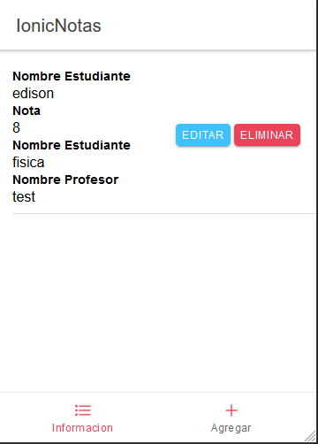
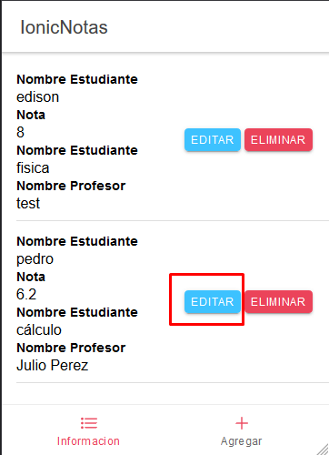
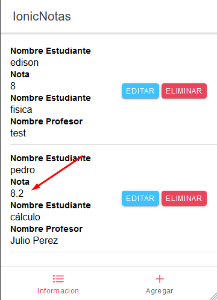
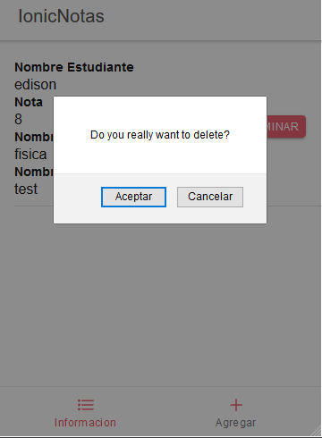

# NotasIonic

IONICNOTAS

TAB HOME

AGREGAR

EDITAR

RESULTADO EDITAR

ELIMINAR

RESULTADO ELIMINAR

Comandos necesarios para la instalación

-----instalacion de capacitor/core al inicar el proyecto

npm install --save @capacitor/core

-----installar el cliente

npm install --save @capacitor/cli

-----iniciar cliente

npx cap init

----- añadir a so android

npx cap add android

------ contruir proyecto

ionic build 

----- actualizar los nuevos archivos
npm update

----- Instalar Una plantilla de interfaz que le ayuda a crear aplicaciones web móviles modernas y rápidas.

npm install @ionic/lab

----- arrancar  

ionic serve